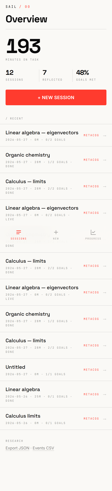
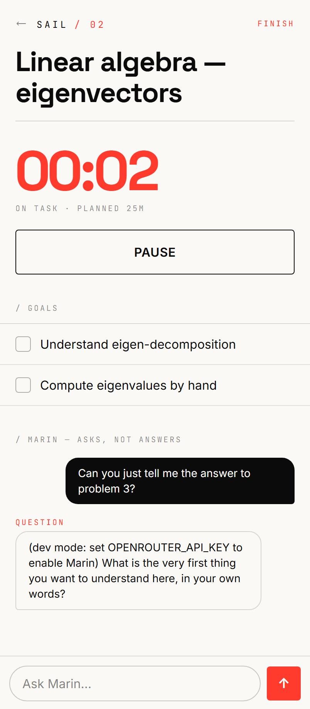
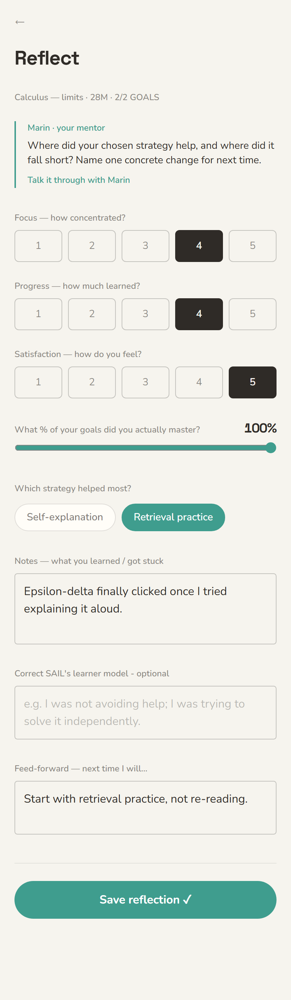
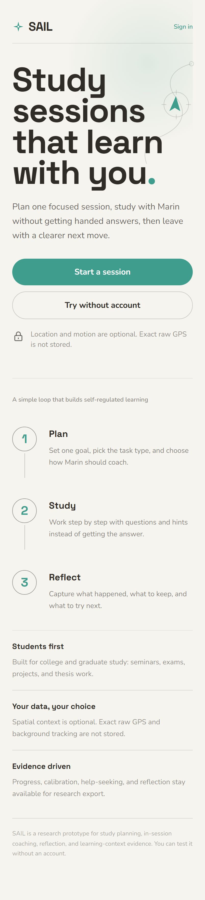
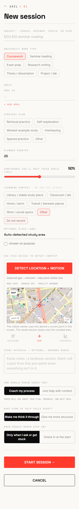

# SAIL - Self-Regulated AI Learning Mentor

SAIL is a research prototype for college and graduate students who need help managing how they learn, not just getting answers. The app turns a study session into a self-regulated learning loop: plan the session, work with an AI mentor, then reflect and adjust.

Live prototype: https://sail-dia.pages.dev  
Project concept: [`PROJECT_CONCEPT.md`](PROJECT_CONCEPT.md)  
Architecture: [`ARCHITECTURE.md`](ARCHITECTURE.md)  
Development log and evidence: [`DEVELOPMENT_LOG.md`](DEVELOPMENT_LOG.md)  
Instructional design principles: [`INSTRUCTIONAL_DESIGN_PRINCIPLES.md`](INSTRUCTIONAL_DESIGN_PRINCIPLES.md)

SAIL is a build artifact for the KPIDT research line on metacognitive prompting, help-seeking quality, judgment-of-learning calibration, and self-regulated AI tutoring.

## Core Concept

Most learning chatbots optimize for fast help. SAIL optimizes for productive self-regulation. Marin, the mentor, is intentionally designed to ask students what they are trying to do, how confident they are, what strategy they are using, when they need a hint, and what they will change next time.

The navigation model follows Zimmerman's SRL cycle:

1. **Forethought** - set goals, choose strategies, estimate confidence, and name the learning context.
2. **Performance** - study with Marin through Socratic prompts, graded hints, progress checks, and help-seeking scaffolds.
3. **Reflection** - rate focus/progress/satisfaction, correct the learner model, and create a feed-forward adjustment.

## Target Users

SAIL is designed for:

- Undergraduate students managing coursework, exam preparation, projects, and lab work.
- Graduate students managing seminar reading, research writing, thesis/dissertation work, and independent study.
- Researchers studying SRL, metacognition, help-seeking, learning analytics, and context-aware AI mentoring.

## Key Screens

| Home | Goal studio | Active mentor |
|---|---|---|
|  |  |  |

| Reflection | Dashboard | Location context |
|---|---|---|
|  |  |  |

## What's Built

- **Goal Studio** (forethought): subject, goals, evidence-based strategy plan, planned minutes, confidence estimate, work type, place context, and mentor style condition.
- **Learning context trace + spatial acquisition**: learner-selected place category plus opt-in browser GPS/device-motion capture. SAIL stores rounded area, movement signals, dwell/transition summaries, and normalized route previews; exact raw GPS is not stored.
- **Active session** (performance): pause/resume timer, live goal checklist, foreground tracking, and the Marin mentor chat. Marin coaches through graded hints and Socratic questions rather than handing over homework answers.
- **Policy-controlled mentor**: a deterministic policy layer decides whether to abstain, prompt monitoring/control/reflection, fade, or escalate; the LLM realizes the selected move.
- **Research Evidence dashboard**: surfaces university work type, help-seeking quality, scaffold fidelity, policy action counts, telemetry event counts, and open learner-model evidence.
- **Reflection** (reflection): focus/progress/satisfaction ratings, context helpfulness, learner-model correction, notes, and feed-forward adjustment.
- **Research instrumentation**: per-turn transcripts, session records, async metric events, condition assignment, redacted telemetry, and JSON/CSV export.
- **Android prototype**: Capacitor build path for a mobile field-study version with location and motion permissions.

JOL is deliberately not collected inside the app. For the intended KPIDT study, JOL remains in a separate LMS/Canvas form to reduce contamination from the mentor interaction.

## Stack

Vite + React 19 + TypeScript + TanStack Router + Tailwind v4 SPA; Hono Node API for local development; Cloudflare Worker + D1 for public deployment; OpenRouter-compatible LLM provider for Marin; Capacitor for Android packaging.

## Run Locally

```bash
# 1) API  (http://localhost:3001)
cd server
cp .env.example .env
# Optional: add OPENROUTER_API_KEY for the live mentor.
# Without it, Marin runs in dev-stub mode.
npm run dev

# 2) App  (http://localhost:5173, proxies /api -> :3001)
cd app
npm install
npm run dev
```

Open http://localhost:5173.

## Cloudflare Deployment

The public build uses:

- `app/` deployed to Cloudflare Pages.
- `worker/` deployed to Cloudflare Workers.
- D1 for session, profile, event, and research export data.

See [`DEPLOY.md`](DEPLOY.md).

## Repository Layout

```text
sail/
  app/          Vite React SPA, Capacitor shell, Android/iOS project files
  server/       Local Hono API, SQLite, mentor engine, export routes
  worker/       Cloudflare Worker API, D1 schema, production routes
  screenshots/  Key product screens
  ARCHITECTURE.md
  BENCHMARKING.md
  DEVELOPMENT_LOG.md
  INSTRUCTIONAL_DESIGN_PRINCIPLES.md
  PROJECT_CONCEPT.md
```

## Research Status

This is an MVP/prototype, not a finished learning platform. The current build is sufficient for concept review, pilot workflow testing, telemetry schema inspection, and preparing a research protocol. Production study use still needs IRB-aligned consent copy, participant management, export validation, and deployment hardening.
